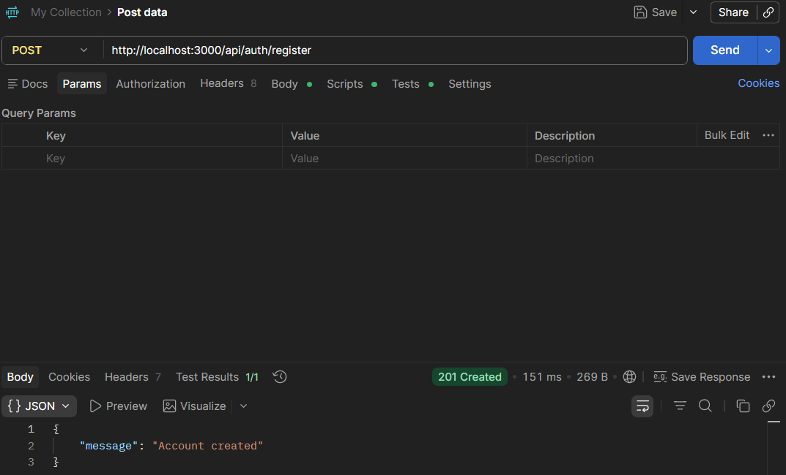
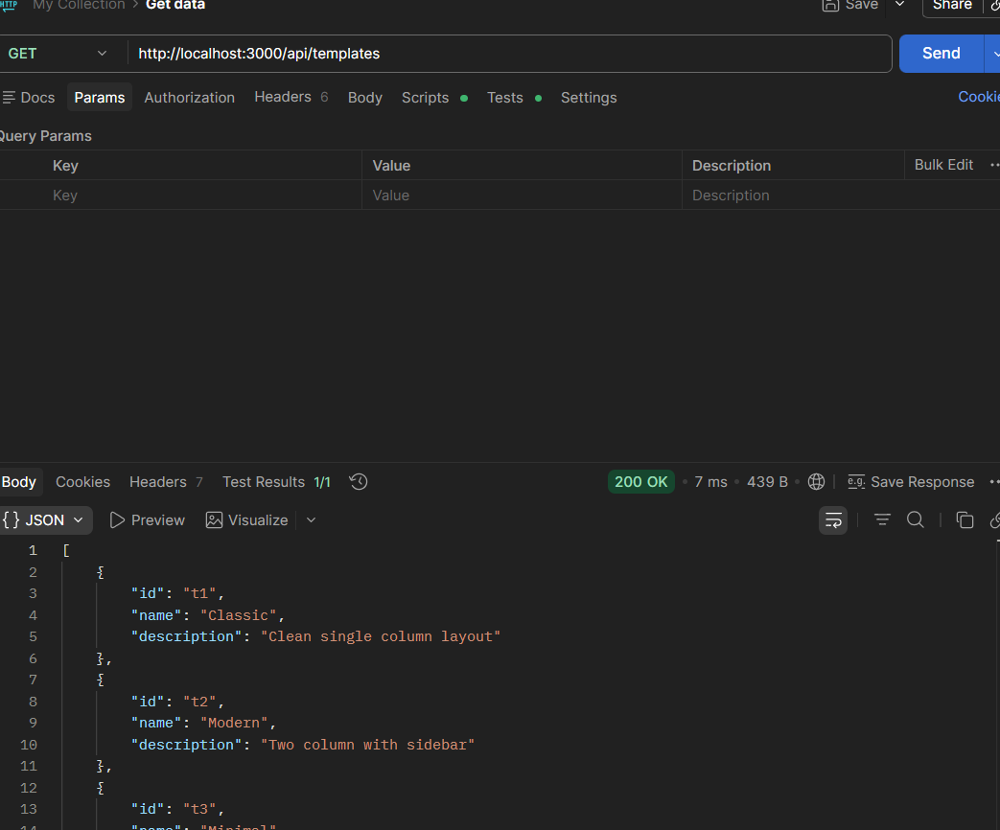
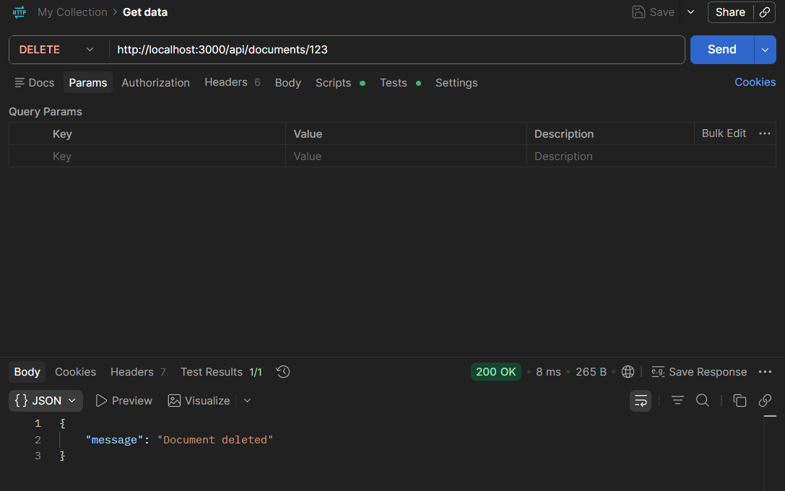
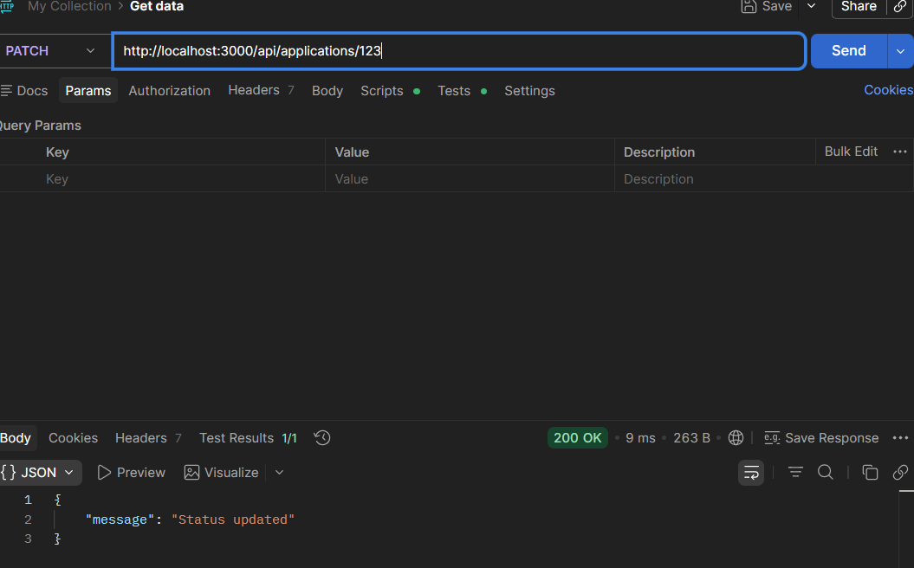

# Resume API

A REST API for an AI Resume Builder built with Node.js + Express.

## How to Run

```bash
npm install
node app.js
```

Server runs on: `http://localhost:3000`

## Routes

### Auth
- POST `/api/auth/register` — Create account
- POST `/api/auth/login` — Login
- POST `/api/auth/logout` — Logout
- POST `/api/auth/forgot-password` — Forgot password
- POST `/api/auth/reset-password` — Reset password

### Users
- GET `/api/users/me` — Get profile
- PUT `/api/users/me` — Update profile
- DELETE `/api/users/me` — Delete account

### Documents
- GET `/api/documents` — List documents
- POST `/api/documents` — Create document
- POST `/api/documents/import` — Import document
- GET `/api/documents/:id` — Get one document
- PUT `/api/documents/:id` — Update document
- POST `/api/documents/:id/duplicate` — Duplicate document
- DELETE `/api/documents/:id` — Delete document

### Sections
- POST `/api/documents/:id/sections` — Add section
- PATCH `/api/documents/:id/sections/:sectionId` — Edit section
- DELETE `/api/documents/:id/sections/:sectionId` — Remove section
- POST `/api/documents/:id/sections/:sectionId/items` — Add item
- PATCH `/api/documents/:id/sections/:sectionId/items/:itemId` — Edit item
- DELETE `/api/documents/:id/sections/:sectionId/items/:itemId` — Remove item

### Versions
- GET `/api/documents/:id/versions` — List versions
- POST `/api/documents/:id/versions` — Save version
- POST `/api/documents/:id/versions/:versionId/restore` — Restore version

### Templates
- GET `/api/templates` — List templates
- GET `/api/templates/:id` — Get one template

### AI
- POST `/api/ai/bullets` — Generate bullet points
- POST `/api/ai/summary` — Generate summary
- POST `/api/ai/rewrite` — Rewrite text
- POST `/api/ai/prompt` — Apply instruction

### Applications
- GET `/api/applications` — List applications
- POST `/api/applications` — Log application
- PATCH `/api/applications/:id` — Update status
- DELETE `/api/applications/:id` — Remove application

## API Testing Screenshots

### POST /api/auth/login


### GET /api/templates


### DELETE /api/documents/:id


### PATCH /api/applications/:id


## Status

All API endpoints have been tested and are working properly with correct JSON responses and status codes.